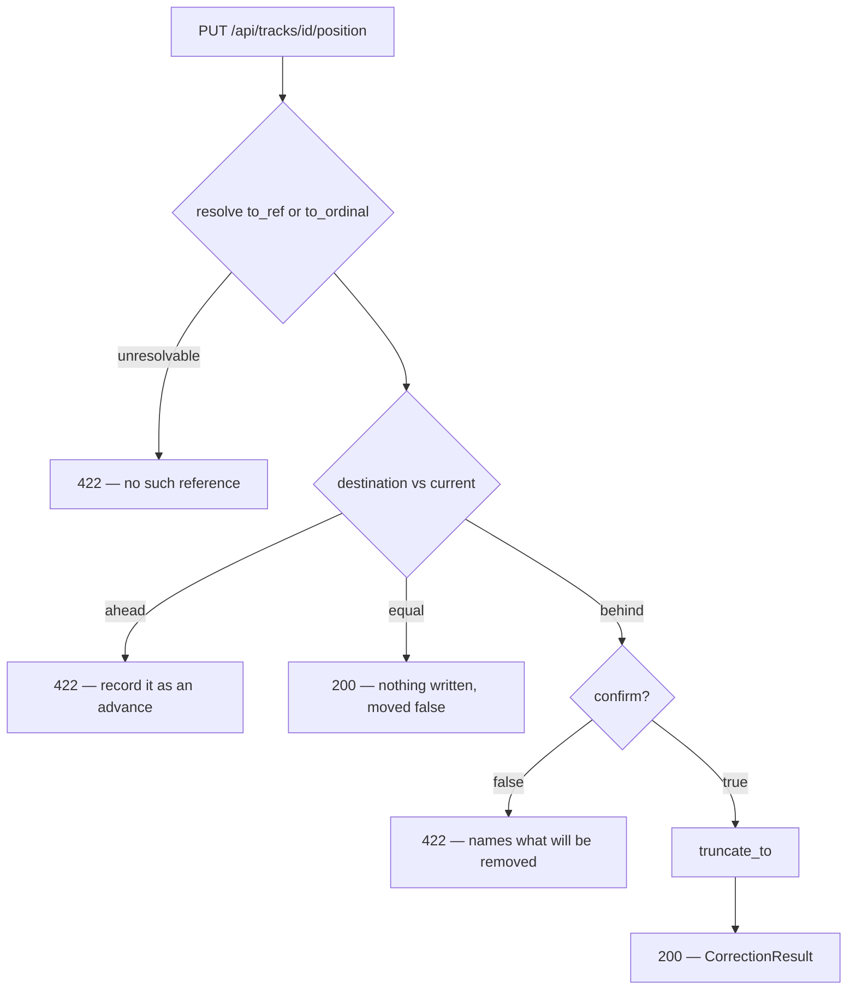
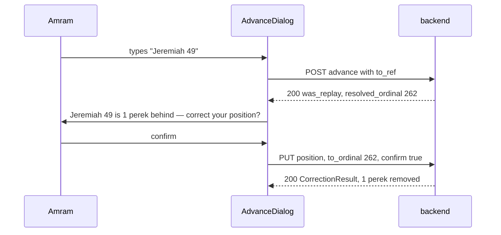

# Correcting a Sidra — Design Specification

**Date:** 2026-08-27
**Status:** Draft for review
**Author:** Design session with Amram
**Extends:** `2026-08-24-torah-sidra-design.md`
**Version:** targets **0.6.0** (minor — two new endpoints, one additive response field)

---

## 1. Purpose

The ledger ratchets. Every position it holds can only ever go up, and nothing in the running app
can move either marker down. Amram put it plainly:

> *"I don't have the ability to go backwards in my Sidra. If I accidentally put the wrong updates,
> now I can't go backwards… and second of all, for some reason it thinks I'm supposed to be at
> chapter fifty when I'm at chapter forty nine. So I need a way to update what my actual supposed
> up to date is."*

Two faults, and they are independent. One is the **actual** marker: a mistyped advance is
permanent. The other is the **scheduled** marker: `anchor_date` and `anchor_ordinal` are written
once at seed time and are unreachable thereafter, so a miscalibration is permanent too.

This spec adds one endpoint for each, and nothing else. The schedule endpoint carries two named
routes rather than one, because the two operands of the schedule formula disagree about the past
and choosing between them silently would rewrite measured history — see §5.

---

## 2. The diagnosis that motivated it

Read off the live database on 2026-08-27, not reconstructed from memory.

Neviim carries `anchor_date 2026-08-24`, `anchor_ordinal 260`, `rate 1`, `Period.DAY`. Its advance
rows are 24 Aug (the seeded opening), 25 Aug and 27 Aug. **There is no row for 26 August.**

| | scheduled | actual | debt |
|---|---:|---:|---:|
| 24 Aug | 260 · Jeremiah 47 | 257 · Jeremiah 44 | 3 |
| 25 Aug | 261 · Jeremiah 48 | 261 · Jeremiah 48 | 0 — the four-perek day cleared it |
| 26 Aug | 262 · Jeremiah 49 | 261 · Jeremiah 48 | **1** |
| 27 Aug | 263 · Jeremiah 50 | 263 · Jeremiah 50 *as recorded* | 0 |
| 27 Aug | 263 · Jeremiah 50 | 262 · Jeremiah 49 *as corrected* | **1** |

Two conclusions follow, and both shaped the design.

**The advance cannot have moved the schedule.** `POST /advance` writes an `Advance` row and touches
no `Track` column (`api/routers/tracks.py:270-280`); `scheduled` reads only `anchor_date`,
`anchor_ordinal`, `rate`, `period`, `starts_on` (`ledger/track_state.py:116-125`). The schedule
saying Jeremiah 50 is not contamination — it is what the anchor arithmetic has said all along.

**The anchor is one day early.** `data/tracks.yaml:53-54` seeds Neviim as `scheduled_ref: Jeremiah
47` against `current_ref: Jeremiah 44`, carrying **no date**, so the seeder stamped `anchor_date`
with the seed day and billed 24 August as a learning day. Amram's reading is that Jeremiah 47 was
already true *for* the 24th, which makes that a spurious unit and means he is not a day behind. The
arithmetic is consistent either way; only he knows which day the note described, and he is the
authority on his own learning.

Moving the anchor to 25 August gives `periods_elapsed = 3` and `scheduled = 260 + 2 = 262` —
Jeremiah 49. With the position corrected to 262 as well, the debt is zero, which is what he reports.

**Neviim therefore needs both levers**, and the second one decided the shape of §5.

---

## 3. What this changes in the model, and what it does not

**`actual_ordinal` remains `MAX(Advance.to_ordinal)`** (`ledger/seed_tracks.py:142-151`). This is
the central decision of the whole design. Every consumer — Stats, streaks, pace, the rail, both
ceilings, `is_finished`, `cycle_index` — is built on the assumption that advances only move
forward. Rather than teach every one of them about backwards motion, a correction **makes the rows
tell the truth**. Nothing downstream is modified, and the ten tests that pin forward-only
behaviour stay green untouched.

The alternatives were weighed and rejected:

| Rejected | Why |
|---|---|
| A compensating row with a negative `unit_count` | `actual` would have to become latest-by-time rather than a MAX, and `ADVANCE_HOUR` pins every same-day row to 12:00 UTC, so two corrections on one day become indistinguishable. It also signs `unit_count`, which is a contract change (`ledger/ledger_document.py:75` bounds it `ge=0`) and forces sign handling into Stats' SUM, `days_learned`, `net`, the chavrusa negation, and the streak. |
| Soft-deleting the offending row | Same MAX problem, plus a nullable flag every query must remember to filter. |
| Editing `data/ledger.json` and re-importing | Already possible today via `sidra-db export` / `import` — and it is the *only* correction mechanism that exists. It is CLI-only, wholesale-destructive, and unvalidated beyond foreign keys. Not a feature; a workaround. |

**Nothing is written that records that a correction happened.** A mistyped destination is not an
event — Jeremiah 50 was never learned — so history reads as though it had been typed correctly.
This was Amram's explicit choice. The cost is stated rather than hidden: there is no undo of an
undo, and the confirmation gate in §6 exists because of it.

---

## 4. `ledger/truncate.py` — moving `actual` backwards

```
truncate_to(session, track, target) -> Truncation

  1. delete every Advance whose from_ordinal >= target
  2. trim the row that straddles the target  (from_ordinal < target < to_ordinal):
       to_ordinal = target
       unit_count = target - from_ordinal
       note, occurred_at and hebrew_date are kept
  3. if no surviving row ends at target, and target > 0:
       write one opening row  max(0, target - rate) -> target
       carrying the earliest deleted row's occurred_at and hebrew_date
```

Step 3 is not an invention. It is the seeder's own idiom — `from_ordinal = max(0, current - rate)`
at `ledger/seed_tracks.py:115-122` — and it exists because without it the earliest row's
`from_ordinal` would be a floor no correction could pass. Truncating Neviim to Jeremiah 43 would
otherwise delete the opening row and report the track as never opened.

Its precondition holds by construction. Advance rows are contiguous — each opens at the previous
one's close — so a target falling inside any row's span is trimmed by step 2 and ends there. Step 3
is reached only when the target sits at or below the earliest `from_ordinal`, by which point step 1
has deleted every row, so "the earliest deleted row" always exists.

The synthetic row carries the seeder's note string, which `stats/build_report.py:49` already
excludes from Stats, so it never counts as a day of learning.

Verified against the real Neviim rows `256→257`, `257→261`, `261→263`:

| target | result | actual |
|---|---|---:|
| **262** · Jeremiah 49 | `261→263` trimmed to `261→262` | 262 |
| 261 · Jeremiah 48 | `261→263` deleted; a row already ends at 261 | 261 |
| 259 · Jeremiah 46 | `261→263` deleted; `257→261` trimmed to `257→259` | 259 |
| 256 · Jeremiah 43 | all three deleted; `255→256` written, dated 24 Aug | 256 |
| 0 | all deleted; no opening row | 0 — "not opened" |

`Truncation` (its own file, `ledger/truncation.py`) is a frozen dataclass carrying
`from_ordinal`, `to_ordinal`, `removed_advances`, `removed_units`.

### Consequences that are correct and deliberate

- **The reachable ceiling drops with `actual`.** `reachable_ceiling` is
  `max(actual, scheduled or 0, 1) + cycle_length` on a cycle track (`ledger/reachable.py:14-23`).
  After a correction the corrected position *is* the truth, so the ceiling should retreat with it.
  The rail, the picker and the advance endpoint all read it live, so the three cannot disagree.
- **A correction may cross a cycle turn.** Rolling back from `total + 1` to `total` moves
  `cycle_index` from 2 to 1. This is permitted: confining it would reproduce the very bug being
  fixed. `align_to` is untouched — a *typed ref* still resolves into the turn being stood in.
- **Stats needs no change.** It sums `unit_count` per day (`stats/build_report.py:42-51`), so a
  trimmed row makes 27 August read one perek instead of two, which is what happened.

---

## 5. Moving `scheduled` — two operands, named separately

`scheduled` is `anchor_ordinal + f(calendar)` on every track kind — flat-rate at
`ledger/schedule.py:94`, calendar-driven at `ledger/parsha_schedule.py:72`. A miscalibration is
therefore in one of two operands, and **which one is not a detail: they disagree about the past.**

Run both routes for Neviim through `stats/build_report.py:98-100`, which bills a day as the
difference across it:

| route | 24 Aug | 25 | 26 | 27 | opening debt Stats reports |
|---|---|---|---|---|---|
| `anchor_date` → 25 Aug | 260 · *before the origin* | 260 | 261 | 262 | **3** |
| `anchor_ordinal` → 259 | 259 | 260 | 261 | 262 | **2** |

Both land on Jeremiah 49 today. But `stats/scheduled_series.py:26` returns a flat `anchor_ordinal`
for any day before the origin, so shifting the *date* leaves 24 August reading Jeremiah 47 against
Jeremiah 44 — debt 3, the measured fact in `CLAUDE.md` §1 and `tests/db/test_track_state.py:49-64`.
Shifting the *ordinal* rewrites it to 2. **A lever that silently chose one would contradict a
measured constant**, which `CLAUDE.md` §1 forbids. So both are offered, and each is named.

Both are idempotent in outcome — each states an absolute fact rather than applying a delta — so
re-submitting with a different value is exact and repeatable. That is what makes them safe to try.

### 5a. `ledger/reanchor.py` — "it started on ___"

```
reanchor(track, started_on):
    track.anchor_date = started_on
    if track.starts_on is not None:
        track.starts_on = started_on
```

Both columns move together when `starts_on` exists, keeping the row conforming to the invariant
`ledger/effective_anchor.py:5-8` states — a writer that sets one moves the other onto it.

Refusals, all 422: `Period.NONE`; a `started_on` after today, which would make `periods_elapsed`
raise (`ledger/schedule.py:80-81`); and a track whose `starts_on` is still in the future, which has
not begun and belongs to `PATCH /tracks/{id}` instead.

Exact on any track kind — the calendar simply recomputes from the new origin — but **quantised**:
one day moves a flat-rate schedule by `rate`, and a parsha schedule by whatever that day accrued.

### 5b. `ledger/recalibrate.py` — "it should be at ___ today"

```
recalibrate(track, desired, scheduled_today):
    track.anchor_ordinal += desired - scheduled_today
```

One expression for every kind, because both formulas share the `anchor_ordinal +` shape, and exact
at any delta. `anchor_date` is never touched on this route — moving it would make `periods_elapsed`
raise for every earlier day and take `stats/scheduled_series.py` down with it.

Refusals, all 422: `Period.NONE`, same wording as `api/routers/tracks.py:161-165`; `desired`
outside `1 … reachable_ceiling`; a resulting `anchor_ordinal < 1`.

**Its cost, stated rather than buried:** past days recompute from the new anchor, and the old one
is not kept. `stats/scheduled_series.py:5-7` already documents this as a property of rebasing a
start date; this extends it rather than introducing it.

---

## 6. API surface

Shape chosen: **two sibling endpoints**. `POST /advance` and `PATCH /tracks/{id}` are not modified,
so every existing test stays green by construction, and neither endpoint's name becomes a lie —
`advance` never deletes a row.



### `PUT /api/tracks/{id}/position`

`api/models/position_write.py` → `PositionUpdate`, `extra="forbid"`:

| field | type | notes |
|---|---|---|
| `to_ordinal` | `int \| None`, `ge=0` | 0 means "I have not opened this" |
| `to_ref` | `str \| None`, 1..256 | XOR with `to_ordinal`, same validator as `AdvanceRequest` |
| `confirm` | `bool = False` | required to destroy anything |

Refs resolve through the same `resolve_position` + `align_to` path as advance
(`api/routers/tracks.py:226-237`). Returns `CorrectionResult` — `from_ordinal`, `to_ordinal`,
`removed_units`, `removed_advances`, `moved`, `track: TrackRow`.

The unconfirmed 422 names its consequence, following the `forgive` precedent at
`api/routers/tracks.py:184-196`:

> `Neviim: Jeremiah 49 is 1 perek behind Jeremiah 50; this removes 1 perek from 27 August. There is no undo.`

### `PUT /api/tracks/{id}/schedule`

`api/models/schedule_write.py` → `ScheduleUpdate`, `extra="forbid"`, **exactly one** of three:

| field | type | route |
|---|---|---|
| `started_on` | `date \| None` | §5a — moves `anchor_date` |
| `to_ordinal` | `int \| None`, `ge=1` | §5b — moves `anchor_ordinal` |
| `to_ref` | `str \| None`, 1..256 | §5b, after resolution |

**No `confirm`** — nothing is destroyed, and setting it back restores it exactly. Returns `TrackRow`.

*"I'm up to date"* is not a server concept. It is the UI filling the current position into
`to_ordinal`, so there is one code path rather than two.

### `AdvanceResult` gains `resolved_ordinal: int`

A replay currently returns `from == to == current` and says nothing about where the caller aimed
(`api/models/advance_result.py:12-20`), so the UI cannot describe a backwards ref without a third
round trip. **This is a data-contract change**, approved in session; it is purely additive and
nothing that reads `AdvanceResult` breaks.

### Error handling

Both routes reuse the existing `except ValueError → 409` wrapper for calendar and ledger failures,
and both are atomic without any work: `api/deps.py:18` wraps the whole request in one transaction —
`async with factory() as session, session.begin():` — so a partial truncation cannot survive, and
the schedule route's `anchor_ordinal < 1` refusal rolls its own mutation back.

### Fixed in passing, with approval

`api/routers/tracks.py:222` parses `occurred_on` outside the `try`, so a malformed date raises an
uncaught `ValueError` — a 500 rather than a 422. Moved inside, with a test.

---

## 7. Frontend



**`AdvanceDialog.tsx`** — the picker's window opens backwards: `first` becomes
`max(1, actual_ordinal − BEHIND)` rather than `actual_ordinal + 1` (`:64`), with `BEHIND = 20`.
`bySefer` already groups consecutive runs, so units behind fall into their own labelled group. The
submit button relabels by direction — **Record** ahead, **Correct position** behind — and a
consequence line sits above it. A picked unit knows its ordinal, so it routes straight to the right
endpoint with no wasted call; a typed ref takes the sequence above.

The comment at `:136` — *"There is no way to undo an advance, so what is about to be recorded is
spelled out in full"* — is rewritten, not deleted. Spelling out the full ref still matters, because
an address repeats across sefarim.

**`ScheduleDialog.tsx`** (new) — reached from the Track screen only; a rare operation does not
belong on Today. Headed *"Where should this track be today?"*, it puts the two operands of §5 side
by side as named choices rather than picking one silently:

- **It started on ___** — a date field.
- **It should be at ___** — picker plus typed ref, with an **I'm up to date** button filling in the
  current position.

Neither is disabled on any track kind. *"It started on the 25th"* is a true and useful statement
about a parsha track too; it simply moves the schedule by that day's accrual rather than by one
unit, so the field carries a static hint keyed on `kind` and `rate` — *"one day is 1 perek here"*,
*"one day is 1 aliyah, 2 in a combined week"*. Beyond that the operation is its own preview: both
routes state an absolute fact and both return the recomputed `TrackRow`, so the dialog shows where
the schedule landed and he can adjust again. No preview endpoint, and no new `TrackRow` field.

New: `types/CorrectionResult.ts`, two `api` methods, two `tracksSlice` thunks,
`utils/correctionPhrase.ts` for the consequence sentence. `AdvanceDestination` is reused unchanged.

---

## 8. Router split

`api/routers/tracks.py` is 370 lines carrying list, detail, tags, start-date, advance and rail; two
more routes push it past the god-file line. It splits:

- **`tracks.py`** — `GET ""`, `GET /{id}`, `GET /{id}/rail`, and the shared `_rail_span` helper.
- **`track_writes.py`** (new) — `PUT /{id}/tags`, `PATCH /{id}`, `POST /{id}/advance`,
  `PUT /{id}/position`, `PUT /{id}/schedule`.

Both mount under the same `/api/tracks` prefix, so no path changes and no client sees it. Test
imports move with the code; no test assertion changes.

---

## 9. Contracts and prose this falsifies

Three passages assert the premise being removed. All three are rewritten, none deleted — the first
clause of each survives.

| Where | What it claims | What it becomes |
|---|---|---|
| `CLAUDE.md` §4 | *"a correction backwards resolves behind him and stays a replay… and there is no undo"* | The resolution rule stands — a typed ref still lands in the current turn. The finality does not. |
| `ledger/reachable.py:5` | *"There is no undo, so the ceiling is what stands between a mistyped ordinal and a year of phantom learning"* | The ceiling still earns its place; the reason is now that a correction is deliberate and confirmed, not that none exists. |
| `ledger/cycle.py:24-36` | `align_to`'s rationale rests on the same premise | Same rewrite. |

`CLAUDE.md` §8 gains both request bodies as input boundaries: **deserialization** (Pydantic,
`extra="forbid"`, bounded string lengths) and **SQL** (SQLAlchemy bound parameters on the `delete`
and `update`; no string-built SQL anywhere in `truncate_to`).

---

## 10. Testing

Coverage stays gated at 100%, by the dedicated command and never by `addopts`.

| File | Covers |
|---|---|
| `tests/ledger/test_truncate.py` (new) | the five rows of §4 parametrized, including the synthetic opening row and target 0 |
| `tests/ledger/test_recalibrate.py` (new) | flat rate, rate > 1, weekly, both parsha kinds, all three refusals |
| `tests/ledger/test_reanchor.py` (new) | `anchor_date` moved alone and alongside `starts_on`; a future `started_on` refused; a not-yet-begun track refused; the Neviim case landing on 262 |
| `tests/stats/test_scheduled_series.py` (new) | **the §5 table** — a date shift leaves the opening debt at 3, an ordinal shift moves it to 2 |
| `tests/api/test_position.py` (new) | forward refusal, equal no-op, unconfirmed 422, confirmed truncation, ref resolution, rollback across a cycle turn, the ceiling retreating with `actual` |
| `tests/api/test_schedule.py` (new) | the three-way XOR, both routes end to end, chavrusa 422, out-of-range 422, `anchor_ordinal < 1` 422, future `started_on` 422, "I'm up to date", a parsha track |
| `tests/api/test_advance_by_ref.py` | `resolved_ordinal` on a real advance and on a replay; malformed `occurred_on` → 422 |
| `tests/api/test_stats.py` | Stats reconstructs exactly after a truncation |
| frontend | `AdvanceDialog` backwards pick and relabel; `ScheduleDialog`; both thunks |

**No measured fact moves.** The live suite pins Jeremiah 44 → 47 at debt 3
(`tests/db/test_track_state.py:49-64`, `CLAUDE.md` §1) and Avodah Zarah 28b → 38b at 20 amudim. No
test in this change touches those fixtures, and no constant is adjusted to make anything pass.

The ten forward-only tests the recon identified stay green **without modification**, because
`POST /advance` and `PATCH /tracks/{id}` are not changed.

---

## 11. Explicitly out of scope

- Any audit trail of corrections. Chosen against, in session.
- Undoing a correction.
- Backdating an advance from the UI. `occurred_on` exists on the request but the store never sends
  it (`frontend/src/stores/tracksSlice.ts:12-16`). It is a real gap and a separate one: because
  `debt = scheduled − actual` depends on position and not on date, backdating changes Stats and
  streaks but never the debt. Noted, not built.
- Bulk correction across tracks.

---

## 12. Versioning and docs

`docs/versions.md` gains **v0.6.0** — minor: two new endpoints and one additive response field.
`docs/status.md` gains a "Just built" section. `CLAUDE.md` §4 and §8 are amended per §9 above.
The version field in `pyproject.toml` is not edited; that is the release pipeline's job.
